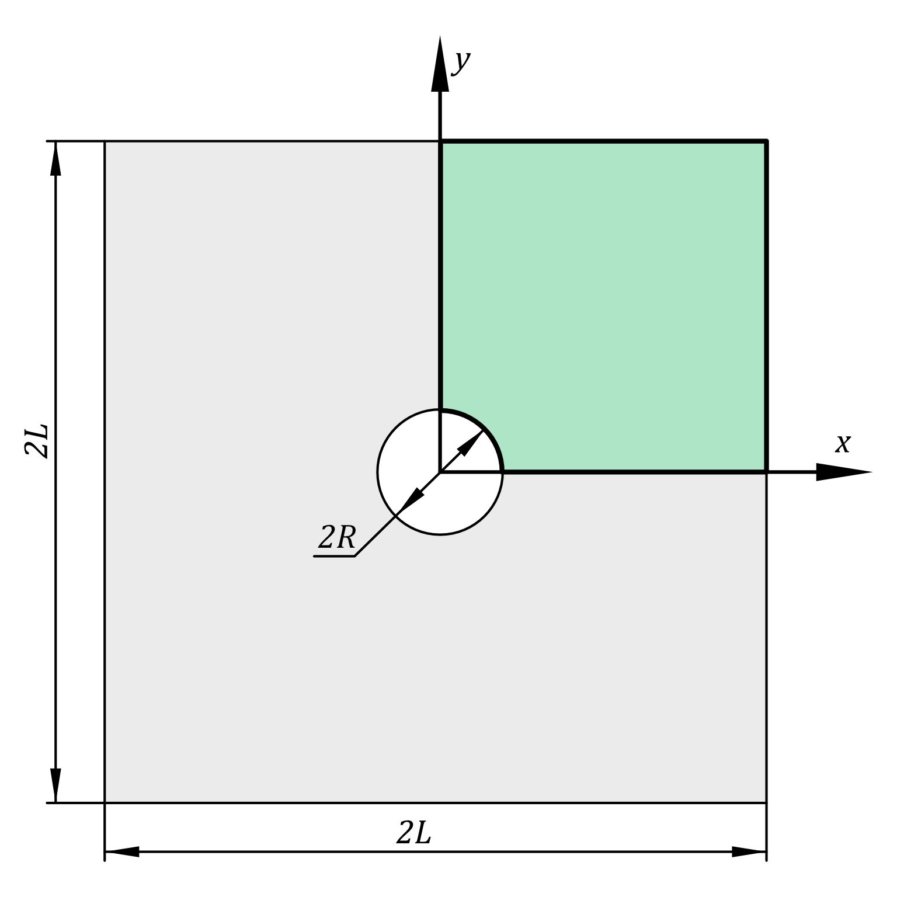

# Orthotropic linear elasticity

The original example is taken from [here](https://comet-fenics.readthedocs.io/en/latest/demo/elasticity/orthotropic_elasticity.py.html). This example just updates code to FEniCSx

## Introduction

In this numerical tour, we will show how to tackle the case of orthotropic elasticity (in a 2D setting).

We consider here the case of a square plate perforated by a circular hole of radius R
, the plate dimension is $2L×2L$
 with $L≫R$
Only the top-right quarter of the plate will be considered. Loading will consist of a uniform traction on the top/bottom boundaries, symmetry conditions will also be applied on the correponding symmetry planes. The geometry is shown on figure

<div style="text-align:center">
  
  <figcaption><b>Problem geometry</b></figcaption>
</div>


```python
import numpy as np
import ufl

from mpi4py import MPI
from petsc4py.PETSc import ScalarType

from dolfinx import mesh, fem, plot, io
from dolfinx.io import XDMFFile, gmshio
from dolfinx.mesh import DiagonalType
import gmsh

import pyvista
```

To generate the perforated domain we use here the mshr module and define the boolean “minus” operation between a rectangle and a circle:


```python
L, R = 1., 0.1
N = 50 # mesh density


SHOW_PYVISTA = False;
# SHOW_PYVISTA = True;

gmsh.initialize();
model = gmsh.model();
model.add("main_domain");
model.setCurrent("main_domain");

try:
    p1 = model.occ.add_point(0, 0, 0);
    p2 = model.occ.add_point(L, 0, 0);
    p3 = model.occ.add_point(L, L, 0);
    p4 = model.occ.add_point(0, L, 0);

    p5 = model.occ.add_point(R, 0, 0);
    p6 = model.occ.add_point(0, R, 0);

    l1 = model.occ.add_line(p5, p2);
    l2 = model.occ.add_line(p2, p3);
    l3 = model.occ.add_line(p3, p4);
    l4 = model.occ.add_line(p4, p6);
    # l5 = model.occ.add_line(p6, p5);
    ar = model.occ.add_circle_arc(p5, p1, p6); 

    curve_loop = model.occ.add_curve_loop([l1, l2, l3, l4, ar]);
    model.occ.synchronize();

    domain = model.occ.add_plane_surface([curve_loop]);

    model.occ.synchronize();

    model.add_physical_group(dim=2, tags=[domain]);
    gmsh.option.setNumber("Mesh.Algorithm", 8);

    # Generate the mesh
    model.mesh.set_size(model.getEntities(0), 0.05);
    model.mesh.set_size([(0, p5),(0, p6)], 0.01);
    model.mesh.generate(dim=2);
    model.mesh.recombine();

    # Create a DOLFINx mesh (same mesh on each rank)
    msh, cell_markers, facet_markers = gmshio.model_to_mesh(model, MPI.COMM_SELF,0,gdim=2);
    msh.name = "Box";
    cell_markers.name = f"{msh.name}_cells";
    facet_markers.name = f"{msh.name}_facets";
finally:
    gmsh.finalize();

if SHOW_PYVISTA:
    
    pyvista.start_xvfb();
    plotter = pyvista.Plotter();

    topology, cell_types, geometry = plot.create_vtk_mesh(msh);
    grid = pyvista.UnstructuredGrid(topology, cell_types, geometry);
    # grid.point_data["u"] = np.c_[uh.x.array.reshape((geometry.shape[0], 2)), np.zeros(geometry.shape[0]).T]
    actor_0 = plotter.add_mesh(grid, style="wireframe", color="k");
    # warped = grid.warp_by_vector("u", factor=500)
    # actor_1 = plotter.add_mesh(warped, show_edges=True)

    plotter.show_axes()
    if not pyvista.OFF_SCREEN:
        plotter.show();
    else:
        figure = plotter.screenshot("fundamentals_mesh.png");
```

    Info    : Meshing 1D...
    Info    : [  0%] Meshing curve 1 (Line)
    Info    : [ 20%] Meshing curve 2 (Line)
    Info    : [ 40%] Meshing curve 3 (Line)
    Info    : [ 60%] Meshing curve 4 (Line)
    Info    : [ 80%] Meshing curve 5 (Circle)
    Info    : Done meshing 1D (Wall 0.00439105s, CPU 0.004977s)
    Info    : Meshing 2D...
    Info    : Meshing surface 1 (Plane, Frontal-Delaunay for Quads)
    Info    : Done meshing 2D (Wall 0.0510802s, CPU 0.043765s)
    Info    : 1034 nodes 2070 elements
    Info    : Recombining 2D mesh...
    Info    : Blossom: 2836 internal 129 closed
    Info    : Blossom recombination completed (Wall 0.0189544s, CPU 0.010118s): 961 quads, 0 triangles, 0 invalid quads, 0 quads with Q < 0.1, avg Q = 0.874401, min Q = 0.42561
    Info    : Done recombining 2D mesh (Wall 0.0191052s, CPU 0.010321s)


```python
Ex, Ey, nuxy, Gxy = 100., 10., 0.3, 5.;
S = as_matrix([[1./Ex,-nuxy/Ex,0.],[-nuxy/Ex,1./Ey,0.],[0.,0.,1./Gxy]])
C = inv(S)
```


```python
V = fem.VectorFunctionSpace(msh, ("CG", 2));

```
